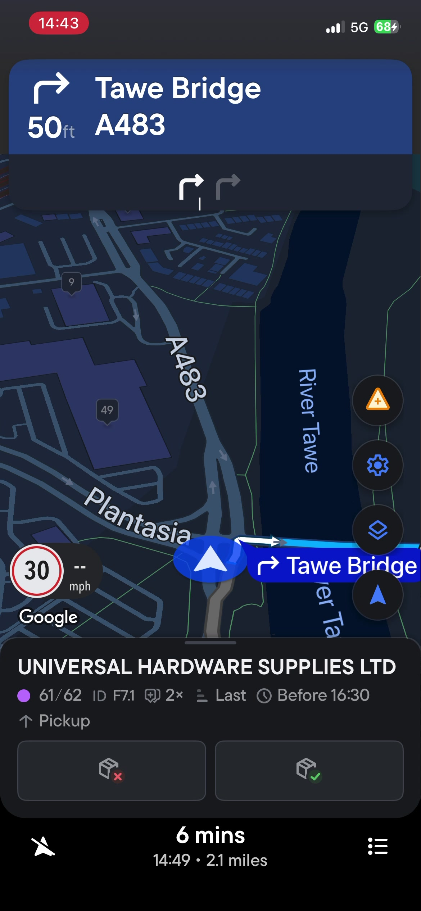
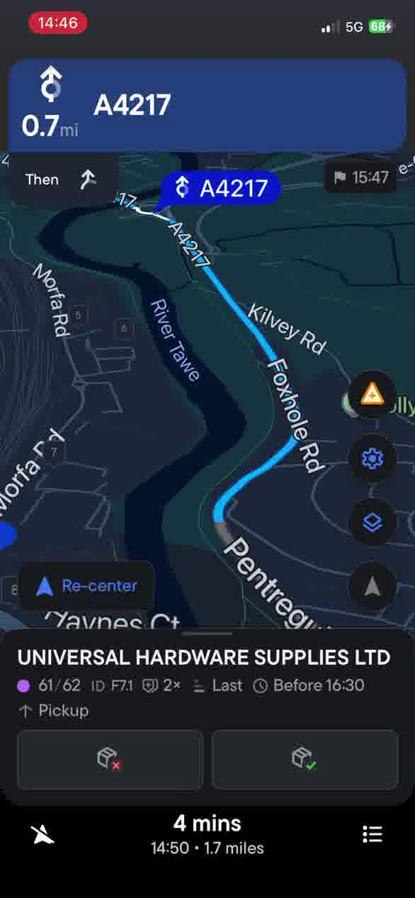
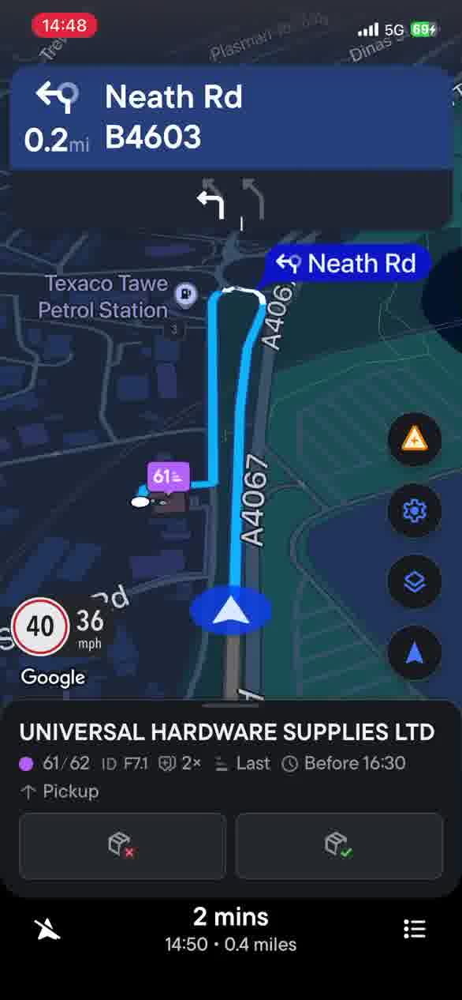
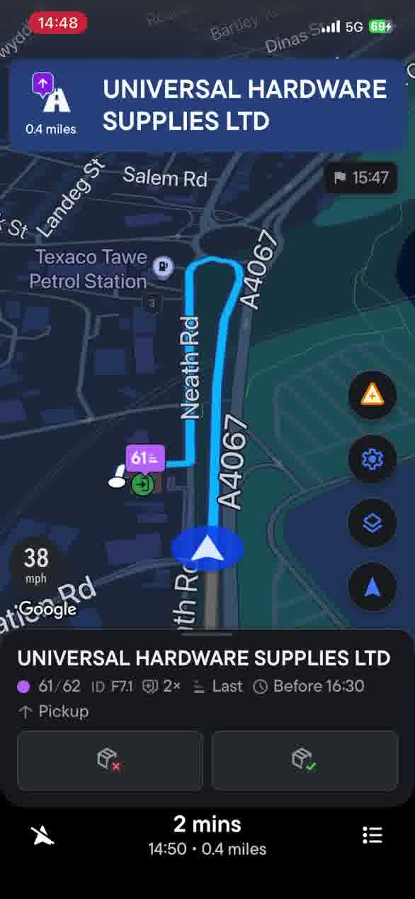
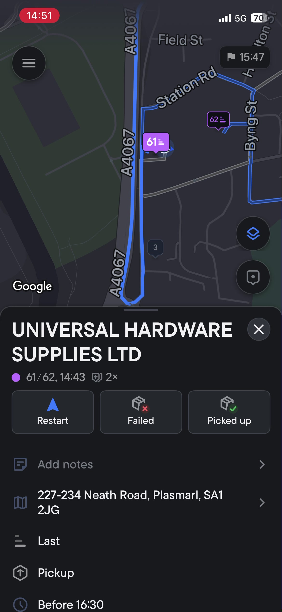
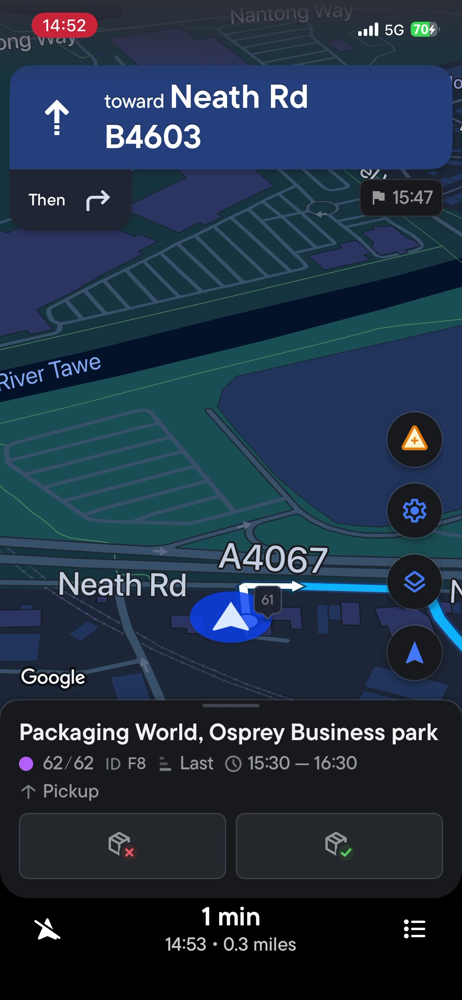

<dl class="report-meta">
  <dt>Device</dt>
  <dd>iPhone 12 Pro, iOS 18</dd>
  <dt>App</dt>
  <dd>Spoke (Circuit) latest version</dd>
  <dt>Navigation</dt>
  <dd>iOS with CarPlay connected</dd>
  <dt>Route area</dt>
  <dd>Fabian Way / Morfa Road / Neath Road / Plasmarl, Swansea</dd>
  <dt>Date</dt>
  <dd>11 March 2026</dd>
  <dt>Onset</dt>
  <dd>Noticeably frequent the past day or two. Persists across app closures and relaunches.</dd>
</dl>

<!-- ════════════════════════════════ BUG 1 ════════════════════════════════ -->

  1
  <h2 class="bug-title" style="border:none; padding:0; margin:0;">Route does not recalculate after deviating from planned turn</h2>

When the navigation instructs a turn and I take a different road instead, the route **does not recalculate**. The navigation continues tracking progress along the original route polyline, even when I am on a completely different road.

At the end of Fabian Way (near Parc Tawe), navigation instructed me to cross Tawe Bridge and continue via Pentreguinea Road / Foxhole Road (east side of the River Tawe). I continued straight onto Morfa Road (west side) instead. The navigation did not recalculate — it continued advancing my position along the original route on the other side of the river.

Evidence

  

    
    01:00 — Instruction
    Navigation says: cross Tawe Bridge on the A483 toward Pentreguinea Rd.
  

  

    
    03:32 — No recalculation
    Map panned to show both roads. I am driving on Morfa Rd (left, blue arrow). The blue route line runs along Foxhole Rd on the other side of the River Tawe (right). The app thinks I'm progressing along the other road.
  

  <video controls preload="metadata">
    <source src="clip-no-recalc.mp4" type="video/mp4">
  </video>
  Clip — Route not recalculating (40s)

  
Technical observation

  GPS position updates correctly (blue arrow is in the right place on Morfa Rd). Distance and ETA update as I drive. But the route geometry and turn instructions do not change — they still reference the A4217 on the other side of the river. The system appears to be <strong>snapping my position to the original route polyline</strong> and advancing progress along it, rather than detecting the deviation and triggering a reroute.

<!-- ════════════════════════════════ BUG 2 ════════════════════════════════ -->

  2
  <h2 class="bug-title" style="border:none; padding:0; margin:0;">Premature / false arrival triggers</h2>

The app triggers "You have arrived" for delivery stops when I am still approaching on the main road, not at the actual destination. This happened **repeatedly** for two consecutive stops. Each time I pressed **Restart**, the false arrival re-triggered almost immediately.

I have experienced similar behaviour in the past when using **Advanced Search** to find an address via postcode — it would often say I'd arrived a few buildings away. I accepted that as a compromise for a highly accurate pin. But when using data sourced directly from **Google Maps** (searching an address and adding it as-is, which is the default), arrival accuracy was always perfect — until now.

This problem has persisted across multiple app closures and relaunches.

Stop 1

  

    Universal Hardware Supplies Ltd
    Stop 61/62
  

  
227-234 Neath Road, Plasmarl, SA1 2JG

  Arrival triggered at <strong>06:22</strong> in the video while still driving north on Neath Road, <strong>0.4 miles</strong> from the destination at 38 mph. Pressed Restart multiple times — arrival kept re-triggering.

  

    
    06:20 — Approaching
    On Neath Road heading north past Texaco Tawe, 0.2mi from the turn. Blue arrow clearly visible on the main road at 36 mph, approaching stop 61.
  

  

    
    06:22 — False arrival
    "Universal Hardware Supplies Ltd — 0.4 miles" appears in the arrival header. Blue arrow still on Neath Road at 38 mph — not even at the Texaco roundabout yet.
  

  <video controls preload="metadata">
    <source src="clip-uhs-arrival.mp4" type="video/mp4">
  </video>
  Clip — UHS false arrivals (50s)

Stop 2

  

    Packaging World, Osprey Business Park
    Stop 62/62
  

  
Byng Street, Plasmarl, SA1 2NR

  After restarting past UHS, navigation to Packaging World began (0.3 miles). The arrival triggered <strong>at least four times</strong> during approach — each time I pressed Restart, it re-triggered within seconds.

  

    
    10:00 — 450 ft away
    After Restart. Still 450ft from the destination. About to falsely arrive again.
  

  

    
    10:10 — False arrival
    Arrival screen triggered at Station Rd / Byng St area, not at the actual premises on Byng Street.
  

  <video controls preload="metadata">
    <source src="clip-pw-arrival.mp4" type="video/mp4">
  </video>
  Clip — PW false arrivals (60s)

  
Observations

  The arrival geofence radius appears too large — both stops trigger while still on the Neath Road approach, not at the actual side-street premises. Pressing Restart does not prevent immediate re-triggering. These are real Google Maps locations (not postcode-derived via Advanced Search), so the coordinates should be accurate.

<!-- ════════════════════════════════ VIDEO ════════════════════════════════ -->

Full screen recording

Full 11-minute iOS screen recording showing both bugs end-to-end:

  <video controls preload="metadata">
    <source src="screen-recording-2026-03-11.mp4" type="video/mp4">
  </video>
  Full recording (11 min)

Video timeline

  

    00:00
    Route begins near New Cut Rd / A483
  

  

    01:00
    Navigation instructs: cross Tawe Bridge
  

  

    01:30
    I continue on Morfa Road — route does not recalculate
  

  

    03:32
    Map panned to show both roads — my position on Morfa Rd, route line on Foxhole Rd
  

  

    05:00
    Route eventually recalculates on A4067 heading north
  

  

    06:15
    Approaching Universal Hardware Supplies on Neath Road
  

  

    06:22
    First false arrival at UHS — still 0.4 miles away at 38 mph
  

  

    06:30
    Multiple Restart cycles — arrival keeps re-triggering
  

  

    09:30
    Navigation to Packaging World begins
  

  

    10:00
    First false arrival at PW (~450 ft away)
  

  

    10:10
    Second, third, fourth false arrivals at PW in quick succession
  

<!-- ════════════════════════════════ CONTEXT ════════════════════════════════ -->

Context

These two bugs may be related. The route recalculation failure (Bug 1) suggests the navigation engine is not correctly detecting when the driver has left the planned route geometry. The false arrival triggers (Bug 2) may share the same root cause — the geofence or position-matching logic is using the polyline position rather than the actual GPS position, causing it to think the driver is closer to the destination than they actually are.

CarPlay was connected and running during this test. Both bugs are present with CarPlay active.

This behaviour has been noticeably frequent over the past day or two. It was not present before that.

